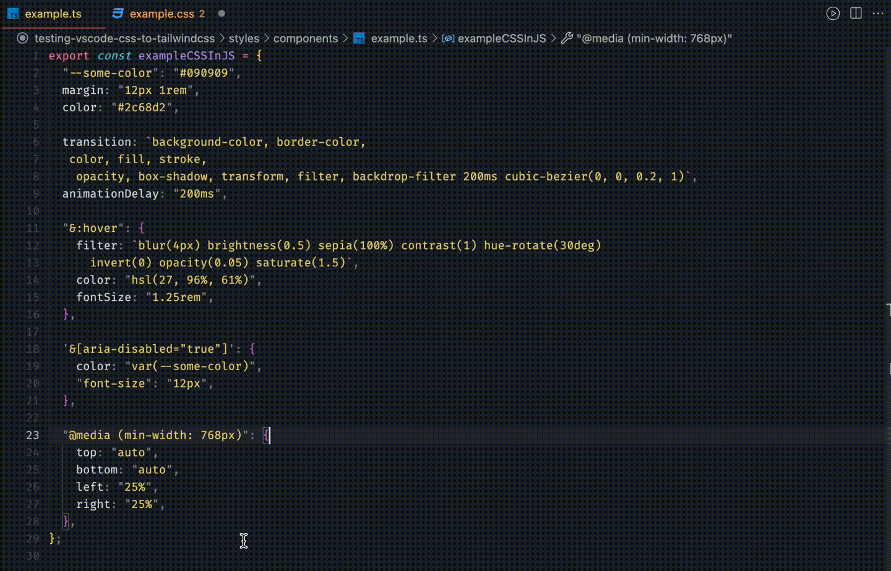

# CSS to TailwindCSS converter (VS Code extension)

**[🔗 NPM Package](https://github.com/Jackardios/css-to-tailwindcss/)**

🔄 Convert your **CSS** to **TailwindCSS** considering workspace tailwind configuration in a few clicks.


You can even convert simple JS objects!:



## Features:

- supports all (or almost all) the features currently available in TailwindCSS
- supports nested sass-like syntax
- automatically finds tailwind config in your workspace and uses it for conversion (it is possible to configure config file path)
- colors are matched regardless of the format used
- rem is converted to px (it is possible to configure the rem size)
- non-convertible CSS declarations are simply skipped
- [ambiguities](https://tailwindcss.com/docs/adding-custom-styles#resolving-ambiguities) when using css variables are resolved automatically

## Installation

**[Install via the Visual Studio Code Marketplace →](https://marketplace.visualstudio.com/items?itemName=Jackardios.vscode-css-to-tailwindcss)**

The extension finds the first [Tailwind config file](https://tailwindcss.com/docs/installation#create-your-configuration-file) named `tailwind.config.js` or `tailwind.config.cjs` in your workspace and uses it when converting CSS. Use `tailwindCSS.experimental.configFile` setting to manually specify the config file(s) yourself instead.

## Usage

1. Select the CSS you want to convert to TailwindCSS
2. Open command pallete (Mac: Shift+Cmd+P; Windows: Shift+Ctrl+P)
3. Run "Convert CSS to TailwindCSS" command

For more convenience, you can also assign a keyboard shortcut to the "Convert CSS to TailwindCSS" command.

## Extension Settings

To avoid duplicate settings, this extension uses the [Tailwind CSS IntelliSense](https://marketplace.visualstudio.com/items?itemName=bradlc.vscode-tailwindcss) settings

### `tailwindCSS.rootFontSize`

**Default: `16`**

Root font size in pixels. Used to convert `rem` CSS values to their `px` equivalents.

### `tailwindCSS.experimental.configFile`

**Default: `null`**

By default the extension will automatically use the first `tailwind.config.js` or `tailwind.config.cjs` file in your workspace that it can find to provide CSS to TailwindCSS converting. Use this setting to manually specify the config file(s) yourself instead.

Example:

```
"tailwindCSS.experimental.configFile": ".config/tailwind.config.js"
```

## Release Notes

### 1.1.0

- Add CSS-in-JS support
- Fix output CSS formatting

### 1.0.0

- Initial release
